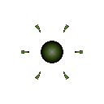

# 산성 세포 (Acid)

  

> _"녹여버린다. 천천히."_

**역할**: ⚔️ 공격형 · **특성**: 부식 (DoT)

## 한 줄 요약

강산성 효소로 적의 외피를 천천히 잠식해 무너뜨리는 부식 사냥꾼.

## 상세 설명

강산성 효소를 분비해 적의 외피를 서서히 잠식하는 부식형 세포입니다. 즉각적인 파괴보다는 시간이 지날수록 효과가 깊어지며, 눈에 띄지 않는 방식으로 전열을 약화시킵니다. 천천히 스며들어 끝내 무너뜨리는 사냥꾼입니다.

산성 공격에 맞은 적은 일정 시간 동안 지속적으로 추가 피해를 받습니다(DoT). 여러 번 맞으면 효과가 재갱신되지만 중첩되지는 않습니다.

## 능력치

| 공격력 | 체력 | 이동속도 | 사정거리 | 공격속도 |
| :----: | :--: | :------: | :------: | :------: |
|   ★★   |  ★★  |    ★★    |   ★★★★   |   ★★★    |

## 행동 시연

|                                         대기                                         |                                          소환                                          |                                          행동                                          |                                         사망                                          |
| :----------------------------------------------------------------------------------: | :------------------------------------------------------------------------------------: | :------------------------------------------------------------------------------------: | :-----------------------------------------------------------------------------------: |
|  |  |  |  |

## 실전 영상

<video src="../../public/assets/video/demos/demo_special_acid.mp4" controls loop muted width="480"></video>

뷰어가 영상을 표시하지 못하면 [데모 영상 파일](../../public/assets/video/demos/demo_special_acid.mp4)을 직접 재생하세요.

## 강점

- 지속 피해(DoT)로 도망치는 적을 끝까지 따라가서 처치 가능
- 다수의 적에게 동시에 부식을 묻혀두면 시간 지나며 누적 피해가 커짐
- 사정거리가 무난해 안정적으로 부식을 묻힐 수 있음

## 약점

- 즉각적인 피해는 평범 — 위급한 상황에 적을 한 방에 처치하긴 어려움
- 체력 · 이동속도가 평이해 단독으로는 약함
- 회복이 강한 적(치유 보유)에겐 효과가 상쇄될 수 있음

## 운용 팁

- 도망치려는 적에게 부식을 묻혀두면 결국 떨어진 뒤에도 피해가 누적됩니다
- 점사 · 포격 세포와 함께 운용해 적 체력을 부식으로 깎으면서 점사로 결정타
- 빙결 세포 결빙 영역과 조합하면 적이 갇힌 채 부식 시간을 벌 수 있어요
