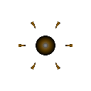

# 융해 세포 (AoE)

  

> _"모든 것을 분자 단위로 분해해주지."_

**역할**: ⚔️ 공격형 · **특성**: 광역 폭발

## 한 줄 요약

적 무리 한복판에서 축적한 에너지를 폭발시켜 주변을 한꺼번에 휩쓰는 광역 폭격기.

## 상세 설명

세포 내부에 축적한 에너지를 폭발적으로 방출하는 융해형 세포입니다. 적 무리 속으로 파고든 뒤 중심부에서 에너지를 터뜨려 주변을 한꺼번에 휩씁니다. 가까워질수록 위협이 커지는, 난전 속에 특화된 존재입니다.

폭발 범위 안의 모든 적에게 동시에 큰 피해를 입히지만, 단일 표적에 대한 효율은 떨어집니다.

## 능력치

| 공격력 | 체력 | 이동속도 | 사정거리 | 공격속도 |
| :----: | :--: | :------: | :------: | :------: |
| ★★★★★  | ★★★★ |    ★★    |    ★★    |   ★★★    |

## 행동 시연

|                                        대기                                         |                                         소환                                          |                                         행동                                          |                                         사망                                         |
| :---------------------------------------------------------------------------------: | :-----------------------------------------------------------------------------------: | :-----------------------------------------------------------------------------------: | :----------------------------------------------------------------------------------: |
|  |  |  |  |

## 실전 영상

<video src="../../public/assets/video/demos/demo_special_aoe.mp4" controls loop muted width="480"></video>

뷰어가 영상을 표시하지 못하면 [데모 영상 파일](../../public/assets/video/demos/demo_special_aoe.mp4)을 직접 재생하세요.

## 강점

- 로스터 최고 수준의 단발 데미지
- 군집전에서 다수의 적에게 동시에 피해를 누적시킴
- 체력도 견고해 적진 한복판 진입에 적합

## 약점

- 이동속도가 느려 추격에 약함
- 단일 대상엔 효율이 떨어짐
- 적이 분산되어 있으면 광역의 이점을 살리기 어려움

## 운용 팁

- 적 군집이 모여 있을 때 가장 빛납니다 — 진영 한복판으로 들어가도록 유도하세요
- 집결로 융해 세포가 앞에 서기보다, 군집 한가운데 위치하게 두면 안전합니다
- 빙결 · 살포 세포로 적을 모은 뒤 융해 세포가 폭격하면 시너지가 큽니다
