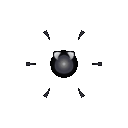

# 암살 세포 (Assassin)

  

> _"뒤에 숨어도 소용 없다. 이미 늦었다."_

**역할**: ⚔️ 공격형 · **특성**: 잠행

## 한 줄 요약

다른 세포는 무시하고 오직 적의 핵만 노리는 잠행 암살. 한 번 표적을 잡으면 끝까지 추격합니다.

## 상세 설명

얇고 흐릿한 막에 몸을 감싼 채 주인 곁을 소리 없이 따라다니는 잠행형 세포입니다. 다른 세포에는 시선을 주지 않고 오직 적의 핵만을 노립니다. 시야 안에 적이 들어선 순간 날카로운 기관을 펼치며 추격을 시작하고, 사냥감이 쓰러질 때까지 결코 추격을 멈추지 않습니다.

표적이 사거리에 들어오면 낫 모양 기관을 펼치고 추격, 사선 슬래시로 핵을 직접 베어냅니다. 다른 세포는 시야에 들어와도 표적으로 삼지 않습니다.

## 능력치

| 공격력 | 체력 | 이동속도 | 사정거리 | 공격속도 |
| :----: | :--: | :------: | :------: | :------: |
|  ★★★★  |  ★   |   ★★★★   |    ★★    |   ★★★    |

## 행동 시연

|                                           대기                                           |                                            소환                                            |                                            행동                                            |                                           사망                                            |
| :--------------------------------------------------------------------------------------: | :----------------------------------------------------------------------------------------: | :----------------------------------------------------------------------------------------: | :---------------------------------------------------------------------------------------: |
|  |  |  |  |

## 실전 영상

<video src="../../public/assets/video/demos/demo_special_assassin.mp4" controls loop muted width="480"></video>

뷰어가 영상을 표시하지 못하면 [데모 영상 파일](../../public/assets/video/demos/demo_special_assassin.mp4)을 직접 재생하세요.

## 강점

- 적 핵에 직접적인 압박을 가할 수 있는 유일한 세포
- 빠른 이동 + 날카로운 단발 슬래시 — 짧은 시간에 결정타 가능
- 적 세포 라인업을 무시하고 핵만 쫓아 효율적인 표적 집중

## 약점

- 로스터 최저 체력 — 한 방에 쓰러질 수 있음
- 광역 공격(융해 · 폭발 · 포격)에 매우 취약
- 적이 유인 · 보호 세포로 핵을 보호하면 효과 반감

## 운용 팁

- 적 후방의 약한 핵을 우선 노리는 결정타 픽
- 단독으론 격추 위험 — 다른 세포로 시선 분산 후 진입
- 적 핵을 보호 세포가 가리고 있다면 보호막부터 우리 화력으로 깎아야 합니다
