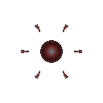

# 폭발 세포 (Bomber)

  

> _"마지막은 화려하게 장식하겠어."_

**역할**: ⚔️ 공격형 · **특성**: 자폭

## 한 줄 요약

적에게 닿는 순간 자신의 소멸과 함께 폭발하는 일회용 폭탄. 단발에 모든 것을 거는 존재.

## 상세 설명

몸 전체를 불안정한 반응에 맞춰 변이시킨 폭발형 세포입니다. 목표와 접촉하는 순간 축적된 에너지를 해방하며, 자신의 소멸마저 공격의 일부로 바꿔버립니다. 오래 살아남기보다 마지막 폭발을 위해 존재합니다.

자폭 시 광역 폭발 피해를 입히며, 자신은 폭발과 동시에 사라집니다. 추격 도중 사망해도 자동 폭발해 일부 피해를 남깁니다.

## 능력치

| 공격력 | 체력 | 이동속도 | 사정거리 | 공격속도 |
| :----: | :--: | :------: | :------: | :------: |
| ★★★★★  |  ★   |  ★★★★★   |    ★★    |    ★     |

## 행동 시연

|                                          대기                                          |                                           소환                                           |                                           행동                                           |                                          사망                                           |
| :------------------------------------------------------------------------------------: | :--------------------------------------------------------------------------------------: | :--------------------------------------------------------------------------------------: | :-------------------------------------------------------------------------------------: |
|  |  |  |  |

## 실전 영상

<video src="../../public/assets/video/demos/demo_special_bomber.mp4" controls loop muted width="480"></video>

뷰어가 영상을 표시하지 못하면 [데모 영상 파일](../../public/assets/video/demos/demo_special_bomber.mp4)을 직접 재생하세요.

## 강점

- 단발 데미지가 로스터 최상위 — 한 마리로 적 핵을 위협 가능
- 빠른 이동속도로 표적까지 정확히 도달
- 죽음의 순간에도 자동 폭발해 피해를 남김

## 약점

- 체력이 낮아 도달 전에 격추당하기 쉬움
- 공격속도가 매우 느림(자폭 후 재생성 대기)
- 적의 카이팅 · 빙결에 매우 취약

## 운용 팁

- 적이 모여 있을 때 자폭 위치를 잘 잡으면 한 번에 큰 보상이 됩니다
- 자폭 전에 격추되지 않도록 다른 세포로 시선을 분산시키는 것이 중요
- 뭉쳐있는 적을 노리는 결정타로 쓰면 강력합니다
