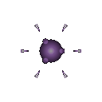

# 유인 세포 (Decoy)

  

> _"나를 봐! 내가 바로 진짜 핵이다!"_

**역할**: 🛡️ 방어형 · **특성**: 유인, 임종 마비

## 한 줄 요약

주인의 핵 신호를 흉내 내 적의 시선을 빼앗는 미끼. 죽음의 순간 마비 충격을 흩뿌립니다.

## 상세 설명

주인의 핵 신호를 흉내 내 적의 시선을 빼앗는 유인형 세포입니다. 진짜와 가짜의 경계를 흐리며, 혼란 속에서 공격의 방향을 바꿉니다. 파괴되는 순간 축적된 신경 충격을 방출해 주변을 순간적으로 마비시키며 짧은 틈을 만들어냅니다.

적 유닛이 핵을 노리고 다가올 때 유인 세포를 우선 표적으로 삼습니다. 죽으면 광역 마비를 발산해 주변 적이 잠시 멈춥니다.

## 능력치

| 공격력 | 체력 | 이동속도 | 사정거리 | 공격속도 |
| :----: | :--: | :------: | :------: | :------: |
|   ★    | ★★★★ |   ★★★★   |    ★★    |    ★     |

## 행동 시연

|                                         대기                                          |                                          소환                                           |                                          사망                                          |
| :-----------------------------------------------------------------------------------: | :-------------------------------------------------------------------------------------: | :------------------------------------------------------------------------------------: |
|  |  |  |

> 유인 세포는 별도의 행동 애니메이션이 없습니다 — 존재 자체가 적의 시선을 끌고, 사망 시 마비 충격을 발산하는 것이 이 세포의 전부입니다.

## 실전 영상

<video src="../../public/assets/video/demos/demo_special_decoy.mp4" controls loop muted width="480"></video>

뷰어가 영상을 표시하지 못하면 [데모 영상 파일](../../public/assets/video/demos/demo_special_decoy.mp4)을 직접 재생하세요.

## 강점

- 적 공격을 핵 대신 받아내는 방패 역할
- 사망 시 마비 충격으로 추격 끊거나 결정적 순간 반격 가능
- 체력 + 속도 모두 무난해 오래 살아남는 편

## 약점

- 직접 데미지 0 — 단독으로 적을 처치할 수 없음
- 사망하지 않으면 마비 효과를 발동할 수 없어 능동적인 활용에 한계

## 운용 팁

- 적 암살 세포가 핵을 노릴 때 유인 세포가 시선을 끌어줍니다
- HP가 떨어진 상태로 적 군집에 진입시키면 마비 한 번에 적을 끊어낼 수 있어요
- 점사 · 포격 같은 후방 화력 세포의 생존을 크게 늘려주는 보조 픽
