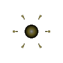
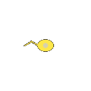

# 전격 세포 (DPS)

  

> _"보이지도 않을 속도로 지져주마."_

**역할**: ⚔️ 공격형 · **특성**: 연격

## 한 줄 요약

번개처럼 빠르게 단일 대상을 갈가리 찢는 단일 처형자. 흩어진 적을 노릴 때 가장 위협적입니다.

## 상세 설명

전기 신호로 편모를 떨며 폭발적인 속도로 움직이는 전격형 세포입니다. 적에게 닿는 순간 짧은 찰나에 연속된 공격을 퍼부으며 전장을 가로지릅니다. 따로 떨어진 단일 개체에게는 가장 위협적인 사냥꾼입니다.

군집전보다 분산된 적을 사냥할 때 가장 효율적이며, 한 번 표적을 정하면 빠르게 처치하고 다음 적으로 이동합니다.

## 능력치

| 공격력 | 체력 | 이동속도 | 사정거리 | 공격속도 |
| :----: | :--: | :------: | :------: | :------: |
|  ★★★   |  ★★  |  ★★★★★   |    ★     |  ★★★★★   |

## 행동 시연

|                                        대기                                         |                                         소환                                          |                                         행동                                          |                                         사망                                         |
| :---------------------------------------------------------------------------------: | :-----------------------------------------------------------------------------------: | :-----------------------------------------------------------------------------------: | :----------------------------------------------------------------------------------: |
|  |  |  |  |

## 실전 영상

<video src="../../public/assets/video/demos/demo_special_dps.mp4" controls loop muted width="480"></video>

뷰어가 영상을 표시하지 못하면 [데모 영상 파일](../../public/assets/video/demos/demo_special_dps.mp4)을 직접 재생하세요.

## 강점

- 로스터 최고 이동속도 + 최고 공격속도
- 단일 표적에 대한 DPS는 압도적
- 빠른 기동으로 후방 약한 적을 잘라낼 수 있음

## 약점

- 체력이 낮아 광역 공격(융해 · 폭발)에 즉사 위험
- 사정거리가 매우 짧아 카이팅에 약함
- 군집 단체전에선 효율이 떨어짐

## 운용 팁

- 점사 세포 · 약한 단일 표적부터 우선 노리세요
- 빠른 이동을 활용해 적의 후방을 두드리고 빠지는 운용이 적합합니다
- 융해 · 폭발 세포가 많은 적 군집엔 무리하게 돌입하지 말 것
