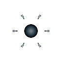

# 빙결 세포 (Frost)

  

> _"도망칠 수 있을 것 같나? 내 영역 안에서."_

**역할**: 🌿 지원형 · **특성**: 결빙 영역

## 한 줄 요약

지나간 자리에 결빙 영역을 남기는 컨트롤러. 적의 속도를 늦춰 전장의 흐름을 끊습니다.

## 상세 설명

냉기를 품은 분비액을 흩뿌려 결빙 영역을 만들어내는 제어형 세포입니다. 직접 공격하기보다 움직임을 가두는 데 능하며, 지나간 자리마다 차가운 흔적을 남깁니다. 전장의 속도를 늦추고 흐름을 끊어내는 존재입니다.

결빙 영역 안의 적은 이동속도가 크게 감소합니다. 영역은 일정 시간 유지된 뒤 사라집니다.

## 능력치

| 공격력 | 체력 | 이동속도 | 사정거리 | 공격속도 |
| :----: | :--: | :------: | :------: | :------: |
|   ★    | ★★★  |   ★★★    |   ★★★★   |    ★★    |

## 행동 시연

|                                         대기                                          |                                          소환                                           |                                          행동                                           |                                          사망                                          |
| :-----------------------------------------------------------------------------------: | :-------------------------------------------------------------------------------------: | :-------------------------------------------------------------------------------------: | :------------------------------------------------------------------------------------: |
|  |  |  |  |

## 실전 영상

<video src="../../public/assets/video/demos/demo_special_frost.mp4" controls loop muted width="480"></video>

뷰어가 영상을 표시하지 못하면 [데모 영상 파일](../../public/assets/video/demos/demo_special_frost.mp4)을 직접 재생하세요.

## 강점

- 적 군집의 속도를 한꺼번에 무력화 — 추격을 끊거나 도주에 활용
- 다른 화력 세포(점사 · 융해 · 포격)와 시너지가 좋음
- 자체 체력이 무난해 전장 후방에서 안정적으로 영역을 깔 수 있음

## 약점

- 직접 데미지가 없어 단독으론 적을 처치하지 못함
- 영역이 좁아 빠른 적은 우회 가능
- 자체 공격속도가 느려 영역 재배치 주기가 김

## 운용 팁

- 적 진영 진입로에 결빙을 깔아두면 적의 돌격 · 카이팅 모두 무너뜨립니다
- 화력 세포 앞에 두면 결빙 → 점사 콤보가 완성됨
- 추격당할 때 도주로에 결빙을 흘려두면 안전 거리를 벌 수 있음
