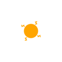
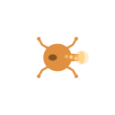
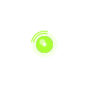
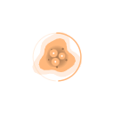

# 특수 세포 도감

전장에서 만날 수 있는 특수 세포 20종의 상세 가이드입니다. 각 세포는 고유한 역할 · 능력치 · 운용법을 가지고 있어요. 카드를 눌러 상세 설명으로 이동하세요.

> 표시되는 스프라이트와 GIF 애니메이션은 인게임에서 그대로 사용되는 시각 그대로입니다. 데모 영상은 실제 게임 플레이를 녹화한 것입니다.

---

## ⚔️ 공격형 (Offense)

전투에서 적을 처치하거나 큰 피해를 입히는 데 특화된 세포들입니다.

| 세포                                                                                                         | 한 줄 소개                                            |
| ------------------------------------------------------------------------------------------------------------ | ----------------------------------------------------- |
| [점사 세포](ranged.md)        | 후방에서 거리를 두고 포자를 사출하는 원거리 저격수    |
| [융해 세포](aoe.md)              | 적 무리 한복판에서 폭발하는 광역 폭격기               |
| [전격 세포](dps.md)              | 번개처럼 빠르게 단일 대상을 갈가리 찢는 단일 처형자   |
| [폭발 세포](bomber.md)        | 적에게 닿는 순간 자폭하는 일회용 폭탄                 |
| [산성 세포](acid.md)            | 강산성 효소로 천천히 적을 녹여 무너뜨리는 부식 사냥꾼 |
| [포식 세포](predator.md)    | 사냥을 이어갈수록 점점 강해지는 연쇄 포식자           |
| [분열 세포](splitter.md)    | 죽음의 순간 작은 분신을 흩뿌리는 증식 폭탄            |
| [돌격 세포](charger.md)      | 일직선 돌진으로 적진을 가르는 차징 스피어             |
| [포격 세포](siege.md)          | 자리를 잡고 멀리서 압축 포자를 날리는 장거리 포대     |
| [암살 세포](assassin.md)    | 다른 세포 무시하고 적의 핵만 노리는 잠행 암살         |

## 🛡️ 방어형 (Defense)

전선을 지키거나 군집을 보호하는 데 특화된 세포들입니다.

| 세포                                                                                                           | 한 줄 소개                                            |
| -------------------------------------------------------------------------------------------------------------- | ----------------------------------------------------- |
| [철갑 세포](tank.md)              | 두꺼운 외피로 충격을 받아내는 군집의 벽               |
| [유인 세포](decoy.md)            | 적의 시선을 유도하고 죽음의 순간 마비를 흩뿌리는 미끼 |
| [보호 세포](protector.md)    | 군집 둘레에 생체 보호막을 펼치는 가디언               |
| [살포 세포](sower.md)            | 가시 함정을 흩뿌려 길목을 봉쇄하는 함정사             |

## 🌿 지원형 (Support)

직접 싸우기보다 군집을 강화하거나 환경을 통제하는 세포들입니다.

| 세포                                                                                                           | 한 줄 소개                                       |
| -------------------------------------------------------------------------------------------------------------- | ------------------------------------------------ |
| [빙결 세포](frost.md)            | 결빙 영역을 만들어 적의 움직임을 가두는 컨트롤러 |
| [채집 세포](magnet.md)          | 흩어진 영양 입자를 끌어모으는 공생 수집가        |
| [가속 세포](velocity.md)      | 주변 세포의 속도를 끌어올리는 신호 펄스 송신기   |
| [증식 세포](breeder.md)        | 끊임없이 새로운 기본 세포를 출산하는 모체        |
| [치유 세포](healer.md)          | 부상 입은 아군에게 회복 자원을 흘려보내는 의무병 |
| [교란 세포](disruptor.md)    | 공명 파동으로 적의 진형을 한꺼번에 흩뿌리는 술사 |

---

## 능력치 보는 법

각 세포 페이지의 능력치 표는 1~5 (또는 6) 별 스케일로 다른 세포와 상대적으로 비교됩니다.

- **공격력** — 단일 공격 시 입히는 피해량
- **체력** — 자체 HP. 보호 세포의 경우 보호막 풀까지 포함
- **이동속도** — 평상시 이동 속도
- **사정거리** — 공격이 닿는 범위 또는 효과 반경
- **공격속도** — 공격 쿨다운의 짧고 긺

별이 많을수록 그 능력치가 강점이며, 별이 적다고 약점이라기보다는 그 능력치를 다른 강점과 교환했다는 의미입니다 (예: 포격 세포는 이동속도 ★ 대신 사정거리 ★★★★★★).

## 역할 태그

- **공격형 (⚔️)** — 적을 직접 처치하는 데 기여
- **방어형 (🛡️)** — 충격을 받아내거나 길목을 봉쇄
- **지원형 (🌿)** — 군집 강화 · 자원 수집 · 적 통제

---

레벨업 보상으로 3종 중 선택할 수 있는 옵션은 무작위로 굴려지므로, 어떤 세포가 와도 자신의 운용에 녹여낼 수 있도록 각 세포의 운용 팁을 익혀두면 좋습니다.
