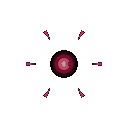

# 포식 세포 (Predator)

  

> _"맛있어 보이는군. 씹어 삼켜주마."_

**역할**: ⚔️ 공격형 · **특성**: 포식 성장

## 한 줄 요약

가장 여린 먹잇감을 한 입에 삼키는 사냥꾼. 한 마리를 삼킬 때마다 체력 · 공격력 · 몸집이 **영구적으로** 1씩 커지는 스노우볼링 유닛입니다.

## 상세 설명

한 입으로 가장 여린 먹잇감을 단번에 삼켜내는 포식형 세포입니다. 한 마리를 삼킬 때마다 송곳니가 한 단계씩 더 날카로워지며, 사냥이 길어질수록 공격이 점점 더 강력해집니다. 작게 시작해, 쓰러뜨린 수만큼 잔혹해지는 사냥꾼입니다.

**처치 보상은 짧은 버프가 아니라 영구 성장입니다.** 기본 세포 한 마리를 처치할 때마다

- 최대 체력 **+1**
- 공격력 **+1**
- 몸집 **+0.1** (시각적으로 점점 거대해짐)
- 즉시 체력 회복

이 성장은 **죽을 때까지 유지**되며, 사망 시 기본 능력치로 리셋됩니다. 즉, 살려서 오래 데리고 다닐수록 스노우볼이 무서워지고, 한 번 잃으면 다시 키워야 합니다.

**먹잇감 = 기본 세포**입니다. 한 입에 삼키며, 성장 보상이 누적됩니다. 초반 공격력이 약하지만 성장이 누적되어 잘 자란 포식 세포는 모든 세포를 위협하는 진짜 사냥꾼이 됩니다.

## 능력치

| 공격력 | 체력 | 이동속도 | 사정거리 | 공격속도 |
| :----: | :--: | :------: | :------: | :------: |
|   ★★   | ★★★  |   ★★★★   |    ★     |   ★★★★   |

## 행동 시연

|                                           대기                                           |                                            소환                                            |                                            행동                                            |                                           사망                                            |
| :--------------------------------------------------------------------------------------: | :----------------------------------------------------------------------------------------: | :----------------------------------------------------------------------------------------: | :---------------------------------------------------------------------------------------: |
|  |  |  |  |

## 실전 영상

<video src="../../public/assets/video/demos/demo_special_predator.mp4" controls loop muted width="480"></video>

뷰어가 영상을 표시하지 못하면 [데모 영상 파일](../../public/assets/video/demos/demo_special_predator.mp4)을 직접 재생하세요.

## 강점

- 기본 세포를 한 입에 삼킴 — HP 무시 즉사
- 처치마다 체력 · 공격력 · 몸집이 영구적으로 누적되어 시간이 갈수록 모든 능력치가 우상향
- 빠른 이동속도 + 매우 넓은 시야로 군집 가장자리의 약한 적을 골라 사냥
- 살려두는 시간이 곧 자산이라 장기전(엔드리스)에서 압도적

## 약점

- **초반엔 매우 약함** — 베이스 공격력 1로 시작, 특수 세포에는 거의 피해 불가
- 사정거리가 매우 짧음 (근접 melee)
- 적이 모두 강한 유닛으로만 구성되어 있으면 먹잇감이 없어 성장이 멈춤
- 사망 시 모든 성장이 리셋 — 다시 처음부터 키워야 함

## 운용 팁

- **기본 세포가 많은 적 군집을 우선 타깃** — 먹잇감 수가 곧 성장 속도
- 증식 · 분열 세포처럼 기본 세포를 양산하는 적에게 강력한 카운터
- 잘 자란 포식 세포는 절대 적 화력에 노출되지 않도록 보호 — 잃으면 처음부터 다시
- 빙결 · 보호 세포로 적 화력을 무력화하면서 사냥감을 안정적으로 공급해 주면 스노우볼 가속
- 두 마리 이상 굴리는 것보다 한 마리를 잘 키우는 게 효율이 큼 (성장은 마리당 독립적이라 분산되면 누적이 늦어짐)
