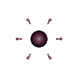
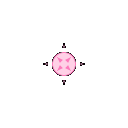

# 점사 세포 (Ranged)

  

> _"지원 사격은 나에게 맡겨."_

**역할**: ⚔️ 공격형 · **특성**: 카이팅

## 한 줄 요약

전선 뒤에서 거리를 유지하며 포자를 사출하는 원거리 저격수. 가까워지면 본능적으로 물러섭니다.

## 상세 설명

체내 압력을 끌어올려 포자를 먼 거리까지 사출하는 점사형 세포입니다. 직접 몸을 부딪치기보다 전선 뒤편에서 간격을 유지하며 사냥감을 약화시키는 데 익숙합니다. 가까워지는 위협에는 본능적으로 물러서며, 안전한 거리에서 공격을 이어갑니다.

## 능력치

| 공격력 | 체력 | 이동속도 | 사정거리 | 공격속도 |
| :----: | :--: | :------: | :------: | :------: |
|  ★★★   |  ★★  |    ★★    |  ★★★★★   |   ★★★    |

## 행동 시연

|                                          대기                                          |                                           소환                                           |                                           행동                                           |                                          사망                                           |
| :------------------------------------------------------------------------------------: | :--------------------------------------------------------------------------------------: | :--------------------------------------------------------------------------------------: | :-------------------------------------------------------------------------------------: |
|  |  |  |  |

## 실전 영상

<video src="../../public/assets/video/demos/demo_special_ranged.mp4" controls loop muted width="480"></video>

뷰어가 영상을 표시하지 못하면 [데모 영상 파일](../../public/assets/video/demos/demo_special_ranged.mp4)을 직접 재생하세요.

## 강점

- 긴 사정거리 — 안전한 거리에서 적을 깎아낼 수 있음
- 카이팅 본능으로 적이 접근하면 알아서 거리를 벌림
- 공격속도가 무난해 꾸준한 점사 화력을 유지

## 약점

- 체력이 낮아 근접 전격 · 분열 세포에 취약
- 단일 점사라 광역 군집전에 화력이 분산됨
- 시야가 가려진 좁은 구간에선 사거리 이점을 살리기 어려움

## 운용 팁

- 군집을 앞에 두고 점사 세포를 가장 뒤로 빼두면 안정적인 화력 거점이 됩니다
- 카이팅 특성을 신뢰하고, 무리하게 앞으로 끌고 가지 마세요
- 살포 · 빙결 세포와 조합하면 적이 사거리에 묶이는 시간을 늘릴 수 있어요
