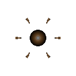

# 포격 세포 (Siege)

  

> _"조준 완료. 포격 발사."_

**역할**: ⚔️ 공격형 · **특성**: 진지화, 일제 사격

## 한 줄 요약

이동을 포기하고 그 자리에 자신을 고정한 장거리 포대. 사정거리 안에 들어선 적에겐 가만히 서 있는 것만으로도 위협.

## 상세 설명

이동을 포기하고 그 자리에 자신을 고정시킨 포격형 세포입니다. 군집이 흩어지면 즉시 진지를 펼쳐 압축된 포자를 가장 먼 거리까지 쏘아 보냅니다. 추격은 불가능하지만, 사정거리 안에 들어선 적은 가만히 서 있는 것만으로도 위협이 됩니다.

이동 → 진지화 → 배치 완료 → 사격 4단계로 동작합니다. 진지화 중엔 잠시 무방비하지만, 배치 완료 후엔 로스터에서 가장 긴 사정거리로 압축 포자를 발사합니다.

## 능력치

| 공격력 | 체력 | 이동속도 | 사정거리 | 공격속도 |
| :----: | :--: | :------: | :------: | :------: |
| ★★★★★  | ★★★  |    ★     |  ★★★★★★  |    ★★    |

## 행동 시연

|                                         대기                                          |                                          소환                                           |                                          행동                                           |                                          사망                                          |
| :-----------------------------------------------------------------------------------: | :-------------------------------------------------------------------------------------: | :-------------------------------------------------------------------------------------: | :------------------------------------------------------------------------------------: |
|  |  |  |  |

## 실전 영상

<video src="../../public/assets/video/demos/demo_special_siege.mp4" controls loop muted width="480"></video>

뷰어가 영상을 표시하지 못하면 [데모 영상 파일](../../public/assets/video/demos/demo_special_siege.mp4)을 직접 재생하세요.

## 강점

- 로스터 최장 사정거리 — 적이 보일 때부터 압박 가능
- 단발 화력도 최상위
- 진지화 후엔 사실상 안전한 후방 화력거점

## 약점

- 이동속도가 최하 — 위치를 잘못 잡으면 그 자리에서 죽음
- 진지화 중엔 잠시 무방비
- 적이 사정거리 밖에서 카이팅하면 무력화

## 운용 팁

- 진지를 펼칠 위치 선정이 가장 중요 — 적 진로를 예측해 미리 자리잡으세요
- 철갑 · 보호 세포로 포격 세포를 지키는 것이 핵심
- 적의 전격 · 분열 세포가 접근해 오면 다른 세포가 우선 처리해야 합니다
