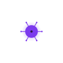
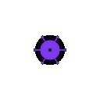
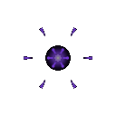

# 살포 세포 (Sower)

  

> _"쫓아오는 건 자유야."_

**역할**: 🛡️ 방어형 · **특성**: 생체 함정

## 한 줄 요약

가시 돋친 생체 함정을 전장 곳곳에 흩뿌리는 함정사. 길목을 봉쇄하고 적의 진형을 무너뜨립니다.

## 상세 설명

가시 돋친 생체 함정을 전장 곳곳에 흩뿌리는 살포형 세포입니다. 설치된 함정은 바닥 위에서 꿈틀거리다 적이 가까이 다가오는 순간 급격히 활성화되며 폭발합니다. 터져 나온 가시와 점액은 주변을 뒤덮어 적 군집의 움직임을 늦추고 진형을 무너뜨립니다.

플레이어 주변을 능동적으로 순찰하며 일정 간격마다 함정을 설치합니다. 적이 함정 근처에 들어오면 짧은 경고 후 폭발 — 광역 피해 + 강력한 슬로우를 동시에 입힙니다. 함정은 일정 거리/시간 이상이면 자동 폭발하며, 제한을 넘으면 가장 오래된 함정도 자동 폭발합니다. 살포 세포가 여러 마리면 함정 제한이 함께 늘어납니다.

## 능력치

| 공격력 | 체력 | 이동속도 | 사정거리 | 공격속도 |
| :----: | :--: | :------: | :------: | :------: |
|   ★★   |  ★★  |    ★★    |   ★★★    |   ★★★    |

## 행동 시연

|                                         대기                                          |                                          소환                                           |                                          행동                                           |                                          사망                                          |
| :-----------------------------------------------------------------------------------: | :-------------------------------------------------------------------------------------: | :-------------------------------------------------------------------------------------: | :------------------------------------------------------------------------------------: |
|  |  |  |  |

## 실전 영상

<video src="../../public/assets/video/demos/demo_special_sower.mp4" controls loop muted width="480"></video>

뷰어가 영상을 표시하지 못하면 [데모 영상 파일](../../public/assets/video/demos/demo_special_sower.mp4)을 직접 재생하세요.

## 강점

- 적 추격을 끊는 데 강함 — 도주로에 함정을 설치하면 추격자에게 광역 폭발 + 슬로우
- 함정 광역 폭발 + 슬로우로 적 군집의 진형을 한꺼번에 무너뜨림
- 살포 세포 여러 마리 운용 시 함정 캡이 누적되어 압도적인 지역 통제력

## 약점

- 직접 공격은 불가 — 함정을 활용해야 진가 발휘
- 함정 설치 후 적이 우회하면 무력화
- 본체가 약해 화력 세포의 표적이 되면 빠르게 격추

## 운용 팁

- 적의 예상 진로에 함정을 흘려두면 적에게 알아서 밟힘
- 추격받을 때 도주로에 살포 세포가 함정을 깔도록 유도하세요 — 추격자 자동 슬로우
- 빙결 · 점사 세포와 시너지가 큼 — 빙결로 적을 묶고 함정으로 가두면 화력 세포가 정리
- 살포 세포가 여러 마리면 가만히 두기보다, 각자 다른 방향으로 산개시키는 것이 효율적
