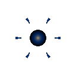

# 철갑 세포 (Tank)

  

> _"내 뒤에 숨어, 나는 무너지지 않는다."_

**역할**: 🛡️ 방어형 · **특성**: 외피 장갑

## 한 줄 요약

겹겹의 세포벽으로 충격을 받아내는 군집의 최전방 벽. 쉽게 무너지지 않습니다.

## 상세 설명

겹겹이 쌓인 세포벽으로 몸을 감싼 방어형 세포입니다. 군집의 가장 앞에서 충격을 받아내며, 적의 돌진을 멈추기 위해 스스로 벽이 됩니다. 쉽게 무너지지 않는 존재로, 전장의 흐름을 지탱하는 축이 됩니다.

외피 장갑 효과로 들어오는 피해를 일정량 감산합니다. 다수의 약한 공격(기본 세포 등)에는 거의 무적에 가깝지만, 한 방이 큰 공격(폭발 · 융해)에는 평범한 피해를 받습니다.

## 능력치

| 공격력 | 체력  | 이동속도 | 사정거리 | 공격속도 |
| :----: | :---: | :------: | :------: | :------: |
|   ★    | ★★★★★ |   ★★★    |    ★     |   ★★★    |

## 행동 시연

|                                         대기                                         |                                          소환                                          |                                          행동                                          |                                         사망                                          |
| :----------------------------------------------------------------------------------: | :------------------------------------------------------------------------------------: | :------------------------------------------------------------------------------------: | :-----------------------------------------------------------------------------------: |
|  |  |  |  |

## 실전 영상

<video src="../../public/assets/video/demos/demo_special_tank.mp4" controls loop muted width="480"></video>

뷰어가 영상을 표시하지 못하면 [데모 영상 파일](../../public/assets/video/demos/demo_special_tank.mp4)을 직접 재생하세요.

## 강점

- 로스터 최상위 체력 + 외피 감산 — 약한 공격 다수는 사실상 무효
- 군집의 전열을 안정적으로 지탱
- 적 돌격을 막아 후방 점사 · 포격 세포의 시간을 벌어줌

## 약점

- 공격력은 거의 무의미한 수준으로 낮음 — 단독으로 적을 처치하기 어려움
- 폭발 세포의 자폭 · 융해 세포의 큰 한 방엔 평범한 피해를 받음
- 사정거리가 짧아 카이팅에 약함

## 운용 팁

- 점사 · 포격 같은 후방 화력형 세포를 보호하는 용도로 가장 잘 활용됩니다
- 집결로 군집을 모은 뒤 철갑이 앞에 서게 배치하면 안정적인 전선이 형성돼요
- 적이 폭발 세포를 많이 데리고 있다면 철갑만으로는 부족하니 보호 세포와 조합하세요
