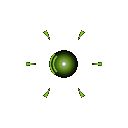

# 가속 세포 (Velocity)

  

> _"한 순간의 속도가, 모든 것을 뒤집는다."_

**역할**: 🌿 지원형 · **특성**: 가속 오라

## 한 줄 요약

주기적으로 펄스를 방출해 주변 세포의 속도를 끌어올리는 신호 송신기.

## 상세 설명

주변 세포의 반응 속도를 끌어올리는 신호 펄스를 주기적으로 방출하는 촉매형 세포입니다. 군집 곁을 따라 움직이며 일정한 간격마다 움직임을 가속시켜, 추격과 도주의 흐름을 자연스럽게 만들어냅니다. 전장의 속도를 조용히 지배하는 존재입니다.

펄스가 발동하면 일정 범위 안의 아군 세포 + 플레이어의 이동속도가 일시적으로 증가합니다. 일정 시간 후 다시 충전됩니다.

## 능력치

| 공격력 | 체력 | 이동속도 | 사정거리 | 공격속도 |
| :----: | :--: | :------: | :------: | :------: |
|   ★    |  ★   |   ★★★★   |   ★★★    |    ★     |

## 행동 시연

|                                           대기                                           |                                            소환                                            |                                            행동                                            |                                           사망                                            |
| :--------------------------------------------------------------------------------------: | :----------------------------------------------------------------------------------------: | :----------------------------------------------------------------------------------------: | :---------------------------------------------------------------------------------------: |
|  |  |  |  |

## 실전 영상

<video src="../../public/assets/video/demos/demo_special_velocity.mp4" controls loop muted width="480"></video>

뷰어가 영상을 표시하지 못하면 [데모 영상 파일](../../public/assets/video/demos/demo_special_velocity.mp4)을 직접 재생하세요.

## 강점

- 추격 · 도주 양쪽에서 결정적인 순간을 만들어냄
- 군집 단위 속도 버프로 다수의 화력 세포가 동시 효과를 받음
- 자체 이동도 빠르고 안전권에 머무름

## 약점

- 자체 전투력 없음
- 펄스 쿨다운이 있어 항상 활성화는 아님
- 체력이 낮아 화력 세포의 직격 한 방에 즉사

## 운용 팁

- 암살 · 폭발 세포처럼 첫 접근이 중요한 세포와 조합하면 펄스 한 번이 게임을 결정
- 적의 추격에서 빠져나올 때 펄스 타이밍을 잘 맞추면 거리를 확실히 벌릴 수 있음
- 가속 세포 자체는 적과 거리를 유지하고, 군집 한가운데 머무르게 두세요
